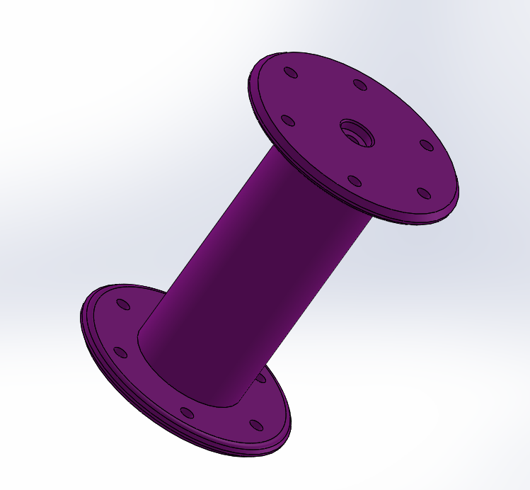

# intermediateArduino 
My intermediateArduino assignments 

These assignments were all about coding and remembering how to code. I often struggle with coding so these assignments took a little longer for me. 

Led Blink Revisted was an assigment in which we were told to wire our arduino and write a code to make a light blink. After we made it blink, we were supposed to make it fade in and out. 

